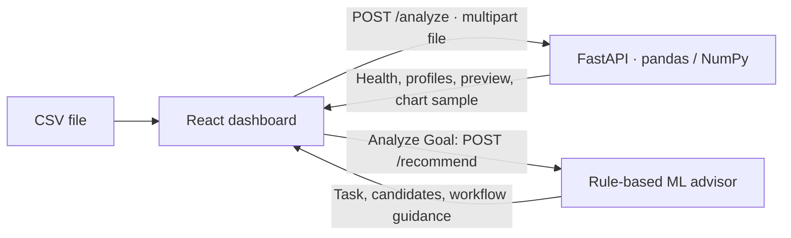

# InsightGenie

**Explore a CSV, understand its data quality, and choose a starting point for machine learning.**


[Overview](#overview) · [Screenshots](#showcase) · [Quick start](#setup) · [Usage](#usage) · [Limitations](#limitations)

<a id="overview"></a>

## 🚀 Overview

InsightGenie is a local web application for exploratory analysis of tabular CSV datasets. A React dashboard presents dataset health, column profiles, interactive charts, and a five-row preview. A FastAPI backend computes the analysis with pandas and NumPy.

Its **rule-based ML advisor** identifies classification, regression, or clustering tasks and returns algorithm suggestions with explanations and a proposed workflow. Recommendations are guidance: the application does not train models, run AutoML, or report predictive performance. No LLM, external AI service, or API key is required.

Upload a file to move from the landing page into the analysis dashboard.


## ✨ Key features

| Capability | What is implemented |
| --- | --- |
| CSV upload | File picker and drag-and-drop upload with CSV validation. |
| Dataset health | Row and column counts, missing cells, duplicate rows, and a heuristic health score. |
| Column profiling | Data types, unique counts, and missing counts in the dashboard; numeric mean, median, standard deviation, quartiles, and extrema in the API. |
| Visual exploration | Numeric histograms, categorical count plots, scatter plots with selectable axes, and missing-value bars. |
| Data preview | The first five records, with the original column names. |
| ML guidance | Task detection, algorithm recommendations, and suggested preprocessing and evaluation steps. |
| Correlations | Numeric correlation matrix returned by the API; no correlation heatmap is currently rendered in the UI. |

## 🧠 AI / ML capabilities

The advisor uses dataset properties and explicit rules in [ml_advisor.py](backend/services/ml_advisor.py). It does not fit or compare the recommended algorithms.

1. **Determine the target.** Use a supplied column when it exists. Otherwise, look for `target`, `class`, `label`, `outcome`, `survived`, or `churn`, in that order, ignoring case. If none matches, suggest clustering.
2. **Infer the task.** Text/category targets, targets with at most two distinct values, and integer targets with fewer than 15 distinct values are treated as classification. Other supplied targets are treated as regression.
3. **Suggest candidates.** For classification, a class representing less than 20% of nonmissing target values changes some recommendation explanations. For regression, row count controls whether a boosting suggestion is included.
4. **Propose a workflow.** Guidance covers missing values, duplicates, numeric scaling, categorical encoding, and task-specific training or evaluation steps. These steps are displayed as text; they do not modify the uploaded data.

| Detected task | Suggested algorithms |
| --- | --- |
| Classification | Logistic Regression, Random Forest Classifier, XGBoost Classifier |
| Regression | Linear Regression, Random Forest Regressor; a boosting/XGBoost suggestion when the dataset has more than 1,000 rows |
| Clustering | K-Means, DBSCAN |

**UI detail:** enter an exact target column name before clicking **Analyze Goal**. The input is labeled optional, but its current handler ignores an empty value. Automatic target detection and the no-target clustering path are available through the API.

The separate [ML workflow template](backend/ml_workflow_template.py) illustrates a scikit-learn preprocessing and Random Forest pipeline. It contains placeholder feature names and commented training/evaluation code, requires additional plotting dependencies, and is not connected to the dashboard.

## 🏗️ Architecture and workflow



Analysis and recommendations are separate requests, each carrying the CSV. The backend reads the full file into a pandas DataFrame. Health metrics and statistics use the full dataset; distribution, count, and scatter charts receive up to **500 rows**, randomly sampled when the file exceeds that size. Missing-value bars use the full-dataset column counts.

Results and the selected file live in React state. There is no database, account system, or saved analysis history.

## 🛠️ Tech stack

| Layer | Technologies | Role |
| --- | --- | --- |
| Frontend | React 19, JavaScript, Vite 7 | Dashboard, state, upload flow, development server and build |
| Styling | Tailwind CSS 3.4, CSS, PostCSS, Autoprefixer | Dark interface, cards, layout, and styling |
| Charts | Recharts 3.5 | Interactive charts and tooltips |
| API | Python, FastAPI, Uvicorn, Pydantic, python-multipart | HTTP routes, response schemas, and uploads |
| Analysis | pandas, NumPy | DataFrame profiling, sampling, and correlations |
| ML template | scikit-learn | Standalone pipeline example; not used to train models in the API |
| Frontend checks | ESLint, React Hooks and React Refresh plugins | Static checks |

Python dependencies are listed in [backend/requirements.txt](backend/requirements.txt). Frontend dependencies and scripts are in [frontend/package.json](frontend/package.json), with a committed npm lockfile.

<a id="showcase"></a>

## 📸 Project showcase

These six screenshots are captures of the actual application. The dashboard examples use the included [synthetic customer dataset](examples/customer-retention.csv): 488 rows, five columns, 34 missing cells, and eight duplicate rows. The application calculates the displayed 92.2% health score; it is a data-quality heuristic, not model accuracy.

### Distribution and ML guidance

A spending histogram sits alongside dataset health, column profiles, regression recommendations for `spend`, and the proposed workflow.


### Explore relationships and data quality

Click a screenshot to view the original at full size.

<table>
  <tr>
    <td width="50%" valign="top">
      <a href="images/03-customer-plan-counts.png"></a>
      <br><strong>Category frequencies</strong><br>Compare Basic, Standard, and Premium plans, including the missing-value category.
    </td>
    <td width="50%" valign="top">
      <a href="images/04-tenure-spend-scatter.png"></a>
      <br><strong>Numeric relationships</strong><br>Select tenure and spending as the scatter plot axes to explore their relationship.
    </td>
  </tr>
  <tr>
    <td width="50%" valign="top">
      <a href="images/05-missing-values-and-data-quality.png"></a>
      <br><strong>Missing-value inspection</strong><br>Locate incomplete columns and review the accompanying cleaning guidance.
    </td>
    <td width="50%" valign="top">
      <a href="images/06-raw-data-preview.png"></a>
      <br><strong>Source data preview</strong><br>Inspect the first five records while keeping health and ML guidance in view.
    </td>
  </tr>
</table>

<a id="setup"></a>

## ⚙️ Installation and setup

Prerequisites:

- **Python 3.13** is the verified local runtime. Backend dependencies are not version-pinned.
- **Node.js 20.19+ within the 20.x line, or 22.12+**, as required by Vite 7, with npm. The local environment uses Node.js 24.
- **Git** to clone the repository.

```bash
git clone https://github.com/vinayak533/InsightGenie-Data-Analyzer.git
cd InsightGenie-Data-Analyzer
```

### Backend

Run from the repository root. Creating a virtual environment keeps the Python dependencies isolated.

<details open>
<summary><strong>Windows · PowerShell</strong></summary>

```powershell
python -m venv .venv
.\.venv\Scripts\python.exe -m pip install -r backend/requirements.txt
```

Using the environment's Python directly does not require changing PowerShell's activation policy.

</details>

<details>
<summary><strong>macOS / Linux · shell</strong></summary>

```bash
python3 -m venv .venv
.venv/bin/python -m pip install -r backend/requirements.txt
```

</details>

### Frontend

```bash
cd frontend
npm ci
cd ..
```

`npm ci` installs the versions recorded in `frontend/package-lock.json`. On PowerShell installations that block `npm.ps1`, use `npm.cmd` for the npm commands.

## ▶️ Run the project

Start two terminals. Keep the backend terminal at the repository root so the package imports resolve.

**Terminal 1 — API (Windows):**

```powershell
.\.venv\Scripts\python.exe -m uvicorn backend.main:app --reload --host 127.0.0.1 --port 8000
```

On macOS/Linux, use `.venv/bin/python` in place of `.\.venv\Scripts\python.exe`.

**Terminal 2 — frontend:**

```bash
cd frontend
npm run dev -- --host 127.0.0.1 --port 5173 --strictPort
```

| Service | Local URL |
| --- | --- |
| Dashboard | [http://127.0.0.1:5173](http://127.0.0.1:5173) |
| API status | [http://127.0.0.1:8000](http://127.0.0.1:8000) |
| Interactive API docs | [http://127.0.0.1:8000/docs](http://127.0.0.1:8000/docs) |

Press **Ctrl+C** in each terminal to stop its service.

<details>
<summary><strong>Frontend checks and build preview</strong></summary>

Run inside `frontend/`:

```bash
npm run lint
npm run build
npm run preview -- --host 127.0.0.1
```

The build writes static assets to `frontend/dist/`. Preview serves those assets locally; the API still needs to be running on port 8000. A frontend build alone does not deploy the backend.

</details>

## 🔧 Configuration

**The app currently reads no project environment variables and requires no `.env` file.** Connection settings are in the source or passed to the development servers.

| Setting | Current value | Where to change it |
| --- | --- | --- |
| Frontend API base | `http://localhost:8000` | Fetch URLs in [UploadWizard.jsx](frontend/src/components/upload/UploadWizard.jsx) and [Dashboard.jsx](frontend/src/components/Dashboard.jsx) |
| Backend host / port | `127.0.0.1:8000` in the commands above | Uvicorn `--host` and `--port` arguments |
| Frontend host / port | `127.0.0.1:5173` in the commands above | Vite CLI arguments; [vite.config.js](frontend/vite.config.js) has no custom server settings |
| CORS origins | `localhost:5173`, `localhost:3000`, and `*`; credentials enabled | Middleware configuration in [main.py](backend/main.py) |
| Chart sample size | At most 500 rows | `get_sample` in [eda.py](backend/services/eda.py) |

Changing the backend port also requires updating both frontend fetch URLs. For hosted use, configure reachable API URLs and explicit allowed origins before deployment.

<a id="usage"></a>

## 💡 Usage examples

### Explore the included dataset

1. Open the dashboard and upload `examples/customer-retention.csv`.
2. Inspect missing values, duplicates, and the per-column profiles.
3. Choose **Histogram → spend**, **Count Plot → plan**, or **Scatter Plot → tenure / spend**. Select a suitable column after changing chart types.
4. Enter `spend` and click **Analyze Goal** for regression guidance. Enter `churn` for classification guidance.
5. Switch to **Data Preview** to inspect the first five rows. Use **Analyze New File** to start another analysis.

### Call the API directly

Run these examples from the repository root. Use `curl.exe` in Windows PowerShell, or `curl` in a Unix shell. Requests use multipart form data, not JSON.

```powershell
# Dataset health, column profiles, correlations, preview, and chart sample
curl.exe -X POST http://127.0.0.1:8000/analyze -F "file=@examples/customer-retention.csv"

# Advice for an explicit regression target
curl.exe -X POST http://127.0.0.1:8000/recommend -F "file=@examples/customer-retention.csv" -F "target_column=spend"

# Omit the target to use API auto-detection (finds churn in this dataset)
curl.exe -X POST http://127.0.0.1:8000/recommend -F "file=@examples/customer-retention.csv"
```

For clustering guidance, omit `target_column` and upload a CSV without any of the recognized target names.

| Route | Input | Response |
| --- | --- | --- |
| `GET /` | None | API status message |
| `POST /analyze` | `file` | `filename`, `health`, `columns`, `correlation_matrix`, `head`, `sample_data` |
| `POST /recommend` | `file`, optional `target_column` | `problem_type`, `target_variable`, `recommendations`, `workflow` |

## 📂 Project structure

```text
InsightGenie-Data-Analyzer/
├── README.md
├── .gitignore
├── backend/
│   ├── __init__.py
│   ├── main.py                    # API routes and CORS
│   ├── schemas.py                 # Pydantic response models
│   ├── requirements.txt           # API dependencies
│   ├── ml_workflow_template.py     # Standalone, unfinished training example
│   └── services/
│       ├── __init__.py
│       ├── eda.py                 # Health, statistics, correlations, sampling
│       └── ml_advisor.py          # Task rules and recommendation guidance
├── frontend/
│   ├── package.json
│   ├── package-lock.json
│   ├── index.html
│   ├── vite.config.js
│   ├── tailwind.config.js
│   ├── postcss.config.js
│   ├── eslint.config.js
│   ├── public/
│   └── src/
│       ├── main.jsx
│       ├── App.jsx
│       ├── index.css
│       └── components/
│           ├── Dashboard.jsx
│           ├── upload/UploadWizard.jsx
│           ├── layout/GlassCard.jsx
│           └── analytics/          # Health, charts, ML advice, workflow
├── examples/
│   └── customer-retention.csv      # Synthetic input used in the screenshots
└── images/                        # Six original application screenshots
```

<a id="limitations"></a>

## 🛡️ Requirements and limitations

- **Local development application.** Authentication, rate limits, and persistent storage are not implemented. CORS is permissive and the frontend assumes a local API; deployment requires additional configuration and access controls.
- **CSV input.** Use a nonempty, header-based CSV with a lowercase `.csv` extension that `pandas.read_csv` can parse with its defaults. Excel workbooks, custom delimiter/encoding controls, and automatic cleaning are not provided. Malformed or unsupported numeric data can fail processing.
- **Memory and sampling.** Each request loads the full file; there is no configured upload cap, streaming analysis, or demonstrated large-dataset benchmark. Charts based on sampled rows may vary between uploads, and category plots show only the top ten categories.
- **Heuristic output.** Task detection can misclassify low-cardinality numeric targets. Recommendations are not validated against your dataset by training or evaluation; XGBoost is suggested by name and is not installed or executed by the API.
- **Chart scope.** The option labeled **Box Plot** renders median/max bars for up to ten numeric columns, rather than a statistical box-and-whisker plot. Correlations are API-only.
- **Health score scope.** The score awards 30 points for successfully reading the structure, up to 40 for completeness, and up to 30 for uniqueness. It does not validate business rules, detect leakage, or guarantee that data is ready for modeling.
- **Dependency reproducibility.** The frontend has a lockfile; backend requirements are unpinned. The standalone ML template additionally imports Matplotlib, seaborn, and joblib and needs data and feature configuration before training can be enabled.

## 🗺️ Possible improvements

These are proposed next steps, not implemented features or delivery commitments:

- Configure the API URL through an environment variable and make target selection a validated column picker.
- Add a true box-and-whisker plot and a correlation heatmap.
- Pin backend dependencies and add automated API tests and CI checks.
- Improve malformed-file errors, upload limits, and handling of nonfinite numeric values.
- Add report export or saved analyses, and separately integrate model training and evaluation if the project grows beyond exploratory guidance.
