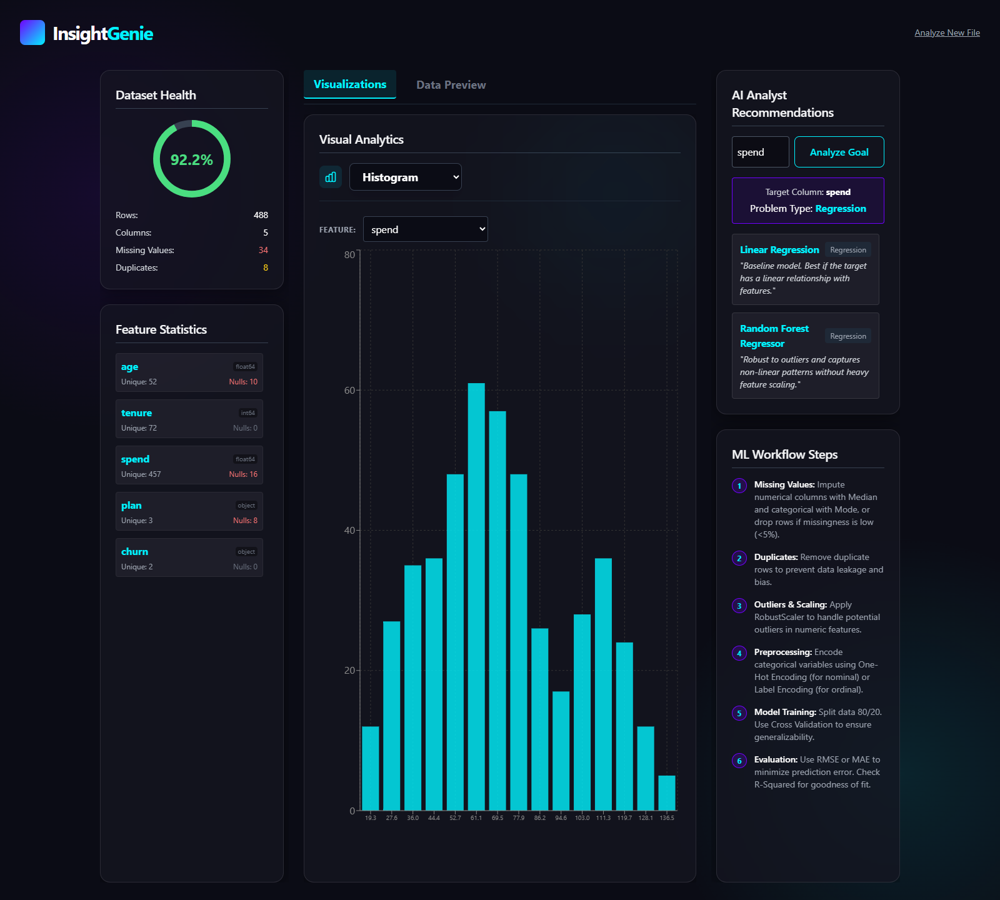
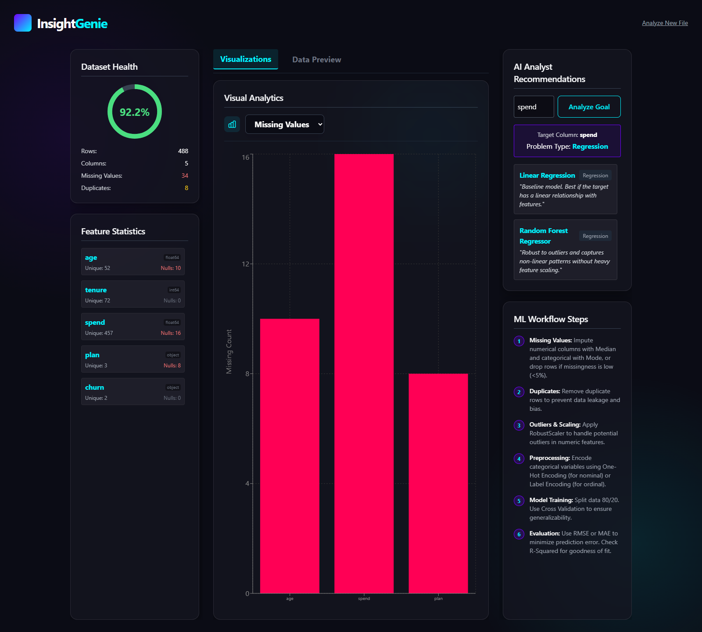
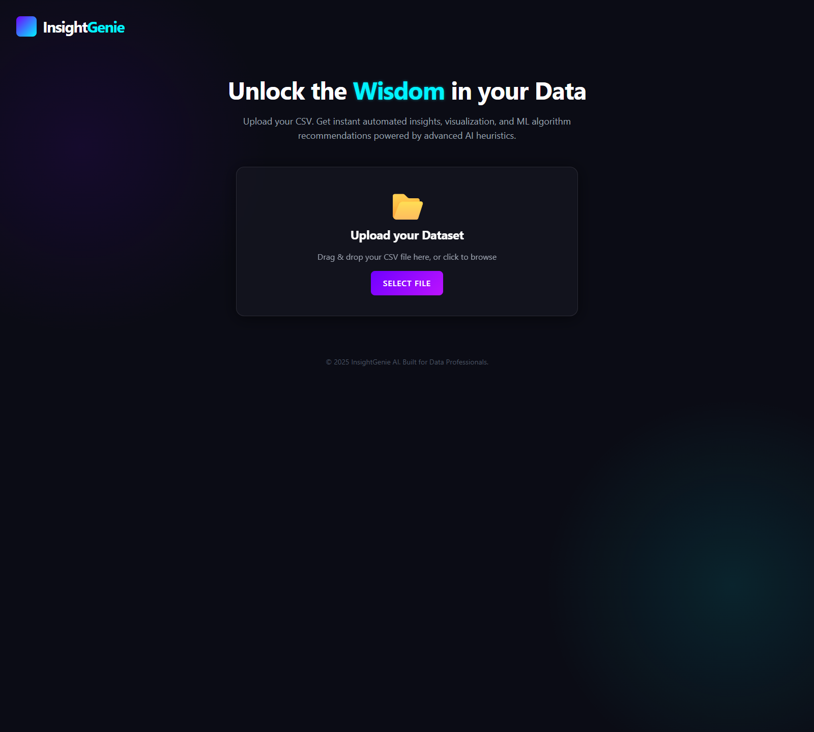
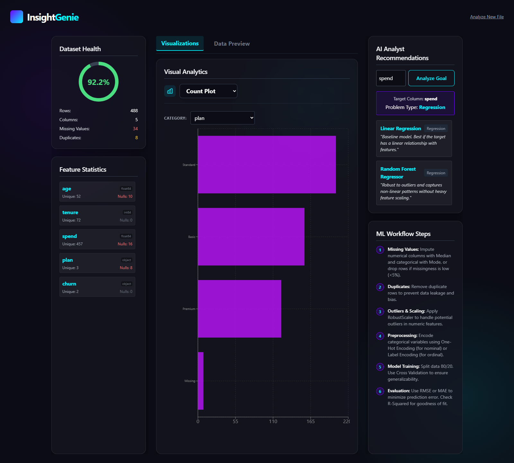
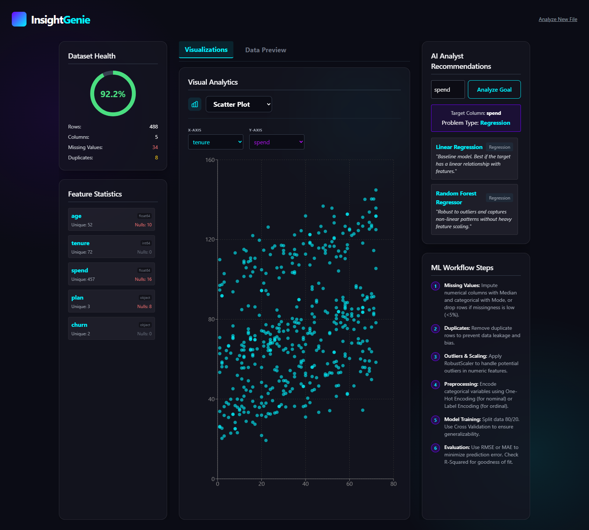
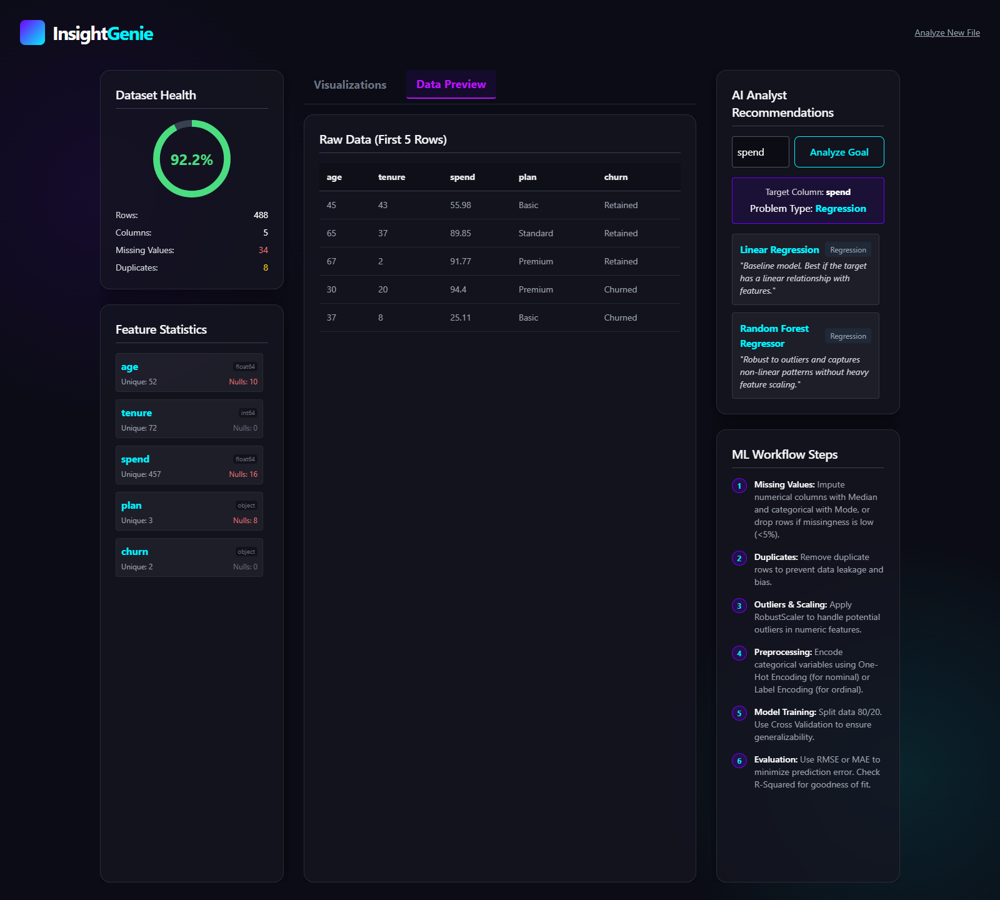
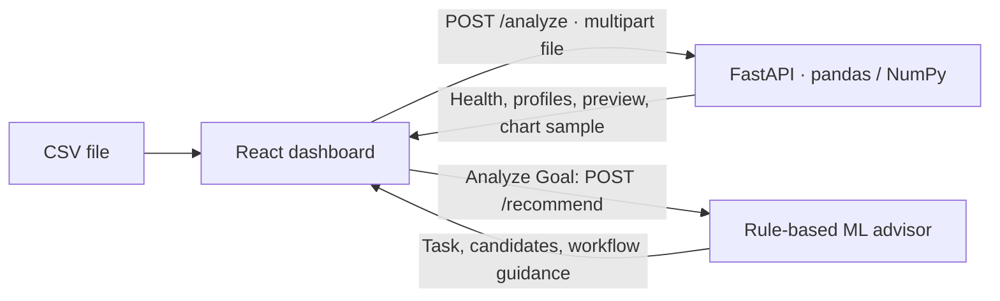

<div align="center">

<h1>InsightGenie</h1>

<p><strong>CSV exploration and explainable ML guidance for analysts and ML engineers—computed locally, with no external AI service.</strong></p>

<p>
  
  
  
  
</p>

<p>
  <a href="#demo--screenshots">Demo</a> ·
  <a href="#api-reference">Docs</a> ·
  <a href="#architecture">Architecture</a> ·
  <a href="#getting-started">Quickstart</a>
</p>



<p><em>Dataset health, interactive exploration, and an explained modeling starting point in one view.</em></p>

</div>

<details>
<summary><strong>Table of contents</strong></summary>

- [The problem and the solution](#the-problem-and-the-solution)
- [Key features](#key-features)
- [Demo / screenshots](#demo--screenshots)
- [Architecture](#architecture)
- [Tech stack](#tech-stack)
- [Engineering highlights](#engineering-highlights)
- [Getting started](#getting-started)
- [Project structure](#project-structure)
- [Roadmap](#roadmap)
- [Author](#author)

</details>

<a id="overview"></a>

## The problem and the solution

Before choosing a model, analysts need to understand missing data, duplicates, feature types, and plausible prediction targets.
InsightGenie combines pandas/NumPy profiling with a React dashboard and a rule-based advisor for classification, regression, or clustering.

It provides algorithm explanations and workflow guidance; it does not train models, run AutoML, or report predictive performance.
No LLM, external AI service, or API key is required.

## Key features

- **CSV upload with validation** — choose a file or drag it onto the upload area to move directly into analysis.
- **Dataset health** — row and column counts, missing cells, duplicate rows, and a heuristic score expose data-quality issues before modeling.
- **Column profiling** — inspect types, unique counts, and missing counts in the UI; retrieve numeric mean, median, standard deviation, quartiles, and extrema through the API.
- **Interactive exploration** — histograms, categorical counts, selectable scatter axes, and missing-value bars make distributions and relationships inspectable.
- **Five-row data preview** — check original column names and records alongside the analysis.
- **Explainable ML guidance** — task detection, candidate algorithms, and preprocessing/evaluation steps give a concrete starting point without modifying the data.
- **Numeric correlations through the API** — retrieve a correlation matrix for further analysis; a UI heatmap remains a roadmap item.

<details>
<summary><strong>See data-quality inspection and the upload flow</strong></summary>



Missing-value bars use full-dataset counts, making incomplete columns visible beside the proposed cleaning steps.



Choose a CSV or drag it onto the upload area to open the analysis dashboard.

</details>

<a id="showcase"></a>

## Demo / screenshots

These six screenshots capture the actual application using the included [synthetic customer dataset](examples/customer-retention.csv).
It has **488 rows, five columns, 34 missing cells, and eight duplicate rows**.
The displayed **92.2% health score** is a data-quality heuristic, not model accuracy.

<details>
<summary><strong>CSV upload</strong> — file picker and drag-and-drop entry point</summary>


Start an analysis by dragging a CSV onto the upload area or choosing a file.

</details>

<details>
<summary><strong>Distribution and ML guidance</strong> — spending histogram and regression candidates</summary>


Explore `spend` while reviewing its proposed modeling workflow.

</details>

<details>
<summary><strong>Category frequencies</strong> — plan counts with missing values</summary>



Compare Basic, Standard, and Premium plans, including the missing-value category.

</details>

<details>
<summary><strong>Numeric relationships</strong> — selectable scatter plot axes</summary>



Select tenure and spending to inspect their relationship.

</details>

<details>
<summary><strong>Missing-value inspection</strong> — incomplete columns and cleaning guidance</summary>


Locate incomplete columns and review the accompanying guidance.

</details>

<details>
<summary><strong>Source data preview</strong> — the first five records</summary>



Inspect the original records while keeping health and ML guidance in view.

</details>

## Architecture



- Analysis and recommendations are separate requests, each uploading and reading the full CSV into a DataFrame.
- Health metrics and statistics use all rows; distribution, count, and scatter charts receive at most **500 rows**, randomly sampled above that size.
- Missing-value bars use full-dataset counts; category charts show the top ten categories. Sampled charts can vary between uploads.
- Explicit advisor rules keep task selection and recommendation explanations inspectable, but can misclassify low-cardinality numeric targets.
- The selected file and results live in React state; there is no database, account system, or saved analysis history.

## Tech stack

| Layer | Tools | Purpose |
| --- | --- | --- |
| Frontend | React 19, JavaScript, Vite 7 | Dashboard, state, uploads, development server, and build |
| Frontend | Tailwind CSS 3.4, CSS, PostCSS, Autoprefixer | Dark interface, cards, layout, and styling |
| Frontend | Recharts 3.5 | Interactive charts and tooltips |
| Backend | Python, FastAPI, Uvicorn, Pydantic, python-multipart | HTTP routes, response schemas, and multipart CSV uploads |
| AI/ML | Explicit Python rules | Task inference, algorithm explanations, and workflow guidance |
| AI/ML | scikit-learn | Standalone preprocessing/Random Forest template; no API model training |
| Data | pandas, NumPy | DataFrame profiling, sampling, statistics, and correlations |
| DevOps | ESLint, React Hooks/Refresh plugins, npm lockfile | Frontend static checks and recorded dependency versions |

Dependencies are documented in [backend/requirements.txt](backend/requirements.txt) and [frontend/package.json](frontend/package.json).
The frontend has a committed npm lockfile; backend requirements are unpinned.

## Engineering highlights

- **Chart payload size → bounded sampling → at most 500 chart rows.** [eda.py](backend/services/eda.py) samples large inputs for distribution, count, and scatter views while retaining full-dataset health and statistics. Each request still loads the whole file into memory.
- **Ambiguous ML task → explicit target and cardinality rules → task-specific candidates and explanations.** [ml_advisor.py](backend/services/ml_advisor.py) uses inspectable rules rather than fitting models; recommendations are guidance, not measured model performance.
- **Data-quality interpretation → separate structure, completeness, and uniqueness scoring.** The score awards 30 points for reading the structure, up to 40 for completeness, and up to 30 for uniqueness. It does not validate business rules, detect leakage, or establish modeling readiness.
- **Different analysis and advice needs → separate API contracts.** `/analyze` returns profiles, correlations, previews, and chart data; `/recommend` returns the inferred task, candidates, and workflow. The trade-off is a second CSV upload and parse when requesting advice.

<details>
<summary><strong>Advisor decision rules and algorithm candidates</strong></summary>

1. **Choose the target.** Use a supplied column when it exists. Otherwise, search for `target`, `class`, `label`, `outcome`, `survived`, or `churn`, in that order, ignoring case. If none matches, suggest clustering.
2. **Infer the task.** Text/category targets, targets with at most two distinct values, and integer targets with fewer than 15 distinct values are treated as classification. Other supplied targets are treated as regression.
3. **Adjust the guidance.** A class representing less than 20% of nonmissing target values changes some classification explanations. Regression row count controls whether a boosting suggestion is included.
4. **Propose a workflow.** Steps cover missing values, duplicates, numeric scaling, categorical encoding, and task-specific training/evaluation. They are displayed as text and do not modify the CSV.

| Detected task | Suggested algorithms |
| --- | --- |
| Classification | Logistic Regression, Random Forest Classifier, XGBoost Classifier |
| Regression | Linear Regression, Random Forest Regressor; boosting/XGBoost when the dataset has more than 1,000 rows |
| Clustering | K-Means, DBSCAN |

XGBoost is suggested by name; it is not installed or executed by the API. None of the candidates is fitted or compared.

The separate [ML workflow template](backend/ml_workflow_template.py) illustrates scikit-learn preprocessing and a Random Forest pipeline.
It has example feature names and commented training/evaluation code, requires Matplotlib, seaborn, and joblib in addition to the backend requirements, and is not connected to the dashboard.
Data and feature configuration are needed before enabling training.

</details>

<a id="setup"></a>

## Getting started

### Prerequisites and installation

- **Python 3.13** — the verified local runtime.
- **Node.js 20.19+ within 20.x, or 22.12+**, with npm — required by Vite 7. The documented local environment uses Node.js 24.
- **Git** — to clone the repository.

```bash
git clone https://github.com/vinayak533/InsightGenie-Data-Analyzer.git
cd InsightGenie-Data-Analyzer
```

Run backend installation from the repository root; a virtual environment isolates Python dependencies.

<details open>
<summary><strong>Windows · PowerShell</strong></summary>

```powershell
python -m venv .venv
.\.venv\Scripts\python.exe -m pip install -r backend/requirements.txt
```

Calling the environment's Python directly avoids changing PowerShell's activation policy.

</details>

<details>
<summary><strong>macOS / Linux · shell</strong></summary>

```bash
python3 -m venv .venv
.venv/bin/python -m pip install -r backend/requirements.txt
```

</details>

Install frontend dependencies from the committed lockfile:

```bash
cd frontend
npm ci
cd ..
```

If PowerShell blocks `npm.ps1`, use `npm.cmd` for npm commands.

### Configuration

**No project environment variables, `.env` file, or API keys are required.**
Connection settings are defined in the source or passed as development-server arguments.

| Setting | Current value | Configuration location |
| --- | --- | --- |
| Frontend API base | `http://localhost:8000` | Fetch URLs in [UploadWizard.jsx](frontend/src/components/upload/UploadWizard.jsx) and [Dashboard.jsx](frontend/src/components/Dashboard.jsx) |
| Backend host / port | `127.0.0.1:8000` in the commands below | Uvicorn `--host` and `--port` |
| Frontend host / port | `127.0.0.1:5173` in the commands below | Vite CLI arguments; [vite.config.js](frontend/vite.config.js) has no custom server settings |
| CORS origins | `localhost:5173`, `localhost:3000`, and `*`; credentials enabled | Middleware in [main.py](backend/main.py) |
| Chart sample size | At most 500 rows | `get_sample` in [eda.py](backend/services/eda.py) |

Changing the backend port requires updating both frontend fetch URLs.
Hosted use requires reachable API URLs, explicit allowed origins, and access controls.

### Run locally 🚀

Start two terminals. Keep the API terminal at the repository root so package imports resolve.

**Terminal 1 — API (Windows):**

```powershell
.\.venv\Scripts\python.exe -m uvicorn backend.main:app --reload --host 127.0.0.1 --port 8000
```

On macOS/Linux, use `.venv/bin/python` in place of `.\.venv\Scripts\python.exe`.

**Terminal 2 — frontend:**

```bash
cd frontend
npm run dev -- --host 127.0.0.1 --port 5173 --strictPort
```

| Service | Local URL |
| --- | --- |
| Dashboard | [http://127.0.0.1:5173](http://127.0.0.1:5173) |
| API status | [http://127.0.0.1:8000](http://127.0.0.1:8000) |
| Interactive API docs | [http://127.0.0.1:8000/docs](http://127.0.0.1:8000/docs) |

Press **Ctrl+C** in each terminal to stop its service.

<details>
<summary><strong>Frontend checks and build preview</strong></summary>

Run inside `frontend/`:

```bash
npm run lint
npm run build
npm run preview -- --host 127.0.0.1
```

The build writes static assets to `frontend/dist/`; preview serves them locally.
The API must still run on port 8000. A frontend build alone does not deploy the backend.

</details>

<a id="usage"></a>

### Explore the included dataset

1. Open the dashboard and upload `examples/customer-retention.csv`.
2. Inspect missing values, duplicates, and per-column profiles.
3. Choose **Histogram → spend**, **Count Plot → plan**, or **Scatter Plot → tenure / spend**. Select a suitable column after changing chart types.
4. Enter `spend` and click **Analyze Goal** for regression guidance; use `churn` for classification guidance.
5. Switch to **Data Preview** to inspect the first five rows. Use **Analyze New File** to restart.

Enter an **exact target column name** before clicking **Analyze Goal**.
Although the input is labeled optional, the current handler ignores an empty value.
Automatic target detection and the no-target clustering path are available through the API.

<a id="api-reference"></a>

### API reference

Run these examples from the repository root. Use `curl.exe` in Windows PowerShell or `curl` in a Unix shell.
Requests use multipart form data, not JSON.

```powershell
# Dataset health, column profiles, correlations, preview, and chart sample
curl.exe -X POST http://127.0.0.1:8000/analyze -F "file=@examples/customer-retention.csv"

# Advice for an explicit regression target
curl.exe -X POST http://127.0.0.1:8000/recommend -F "file=@examples/customer-retention.csv" -F "target_column=spend"

# Omit the target to use API auto-detection (finds churn in this dataset)
curl.exe -X POST http://127.0.0.1:8000/recommend -F "file=@examples/customer-retention.csv"
```

For clustering guidance, omit `target_column` and upload a CSV without any recognized target names.

| Route | Input | Response |
| --- | --- | --- |
| `GET /` | None | API status message |
| `POST /analyze` | `file` | `filename`, `health`, `columns`, `correlation_matrix`, `head`, `sample_data` |
| `POST /recommend` | `file`, optional `target_column` | `problem_type`, `target_variable`, `recommendations`, `workflow` |

<a id="limitations"></a>

<details>
<summary><strong>Input requirements and operational limits</strong></summary>

- **Local development scope.** Authentication, rate limits, and persistent storage are not implemented. CORS is permissive and frontend URLs assume a local API; deployment needs additional configuration and access controls.
- **CSV input.** Use a nonempty, header-based file with a lowercase `.csv` extension that `pandas.read_csv` can parse with its defaults. Excel workbooks, custom delimiter/encoding controls, and automatic cleaning are not provided. Malformed or unsupported numeric data can fail processing.
- **Memory.** Each request loads the full file; there is no configured upload cap or streaming analysis.
- **Chart scope.** **Box Plot** currently renders median/max bars for up to ten numeric columns rather than a statistical box-and-whisker plot. Correlations are API-only.
- **Heuristics.** Task inference can misclassify low-cardinality numeric targets. Model recommendations are not validated by training or evaluation; the health score does not establish modeling readiness.
- **Dependencies.** Backend requirements are unpinned. The standalone ML template needs additional plotting dependencies and configured data/features before training can be enabled.

</details>

## Project structure

```text
InsightGenie-Data-Analyzer/
├── README.md
├── .gitignore
├── backend/                       # FastAPI application and analysis services
│   ├── __init__.py
│   ├── main.py                    # HTTP routes and CORS
│   ├── schemas.py                 # Pydantic response models
│   ├── requirements.txt           # Backend dependencies
│   ├── ml_workflow_template.py     # Standalone training example; not integrated
│   └── services/                  # Data profiling and rule-based ML guidance
│       ├── __init__.py
│       ├── eda.py
│       └── ml_advisor.py
├── frontend/                      # React dashboard and frontend tooling
│   ├── package.json
│   ├── package-lock.json
│   ├── index.html
│   ├── vite.config.js
│   ├── tailwind.config.js
│   ├── postcss.config.js
│   ├── eslint.config.js
│   ├── public/                    # Static public assets
│   └── src/                       # App entry points, styles, and components
│       ├── main.jsx
│       ├── App.jsx
│       ├── index.css
│       └── components/            # Dashboard, upload, layout, and analytics
│           ├── Dashboard.jsx
│           ├── upload/UploadWizard.jsx
│           ├── layout/GlassCard.jsx
│           └── analytics/         # Health, charts, ML advice, and workflow
├── examples/                      # Synthetic input used in the screenshots
│   └── customer-retention.csv
└── images/                        # Six original application screenshots
```

## Roadmap 🗺️

These are proposed next steps, not delivery commitments.

- [ ] Configure the API URL through an environment variable and replace free-text targets with a validated column picker.
- [ ] Add a true box-and-whisker plot and a correlation heatmap.
- [ ] Pin backend dependencies and add automated API tests and CI checks.
- [ ] Improve malformed-file errors, enforce upload limits, and handle nonfinite numeric values.
- [ ] Add report export or saved analyses; integrate model training and evaluation separately if the project expands beyond exploratory guidance.

## Author

**Vinayak K V** · AI/ML Engineer at AMnova Technologies

[GitHub](https://github.com/vinayak533) · [LinkedIn](https://linkedin.com/in/vinayak-kv-ds) · [Email](mailto:vinayakkvjob@gmail.com)

Building production multi-agent AI systems. Open to technical discussions and collaboration.
